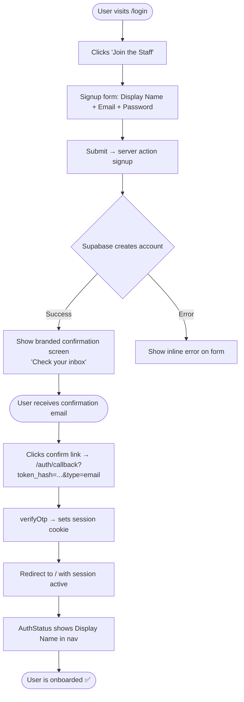

# 🧑‍🍳 Onboarding Architecture — The Living Cookbook

**Purpose:** Architectural reference for the two user entry paths into the app.  
**Last Updated:** 2026-04-22  
**Status:** ✅ Both processes fully implemented. M1 household context added. See open items at the bottom.

---

## Process 1: New User (Direct Signup)

### Flow



### Current State

| Step | Status | Notes |
|------|--------|-------|
| Login/Signup form at `/login` | ✅ Done | Includes display_name field |
| `signup()` server action | ✅ Done | Collects display_name, email, password |
| `profiles` table | ✅ Done | Auto-created via `on_auth_user_created` trigger |
| Trigger upserts display_name | ✅ Done | `handle_new_user()` SECURITY DEFINER function (`search_path = public`). Migration: `20260419090000_add_profile_creation_trigger.sql`. |
| Signup success screen | ✅ Done | Shows "Check your inbox" state |
| `/auth/callback` route | ✅ Done | Handles both `token_hash` (email OTP) and `code` (PKCE) |
| Display name shown in nav | ✅ Done | `AuthStatus` reads from `profiles.display_name` |
| Password reset (`/login/forgot-password`) | ✅ Done | Sends reset email via `resetPasswordForEmail` |
| Password update (`/login/reset-password`) | ✅ Done | Handles `type=recovery` token via callback |
| Profile page (`/profile`) | ✅ Done | User can update display name post-signup |
| Branding on confirmation email | ⏳ Pending | Still using default Supabase template — fix before production launch |

---

## Process 2: Invited User (Household Invite Link)

### Flow

```mermaid
flowchart TD
    A([Existing member copies Share Link]) --> B["URL: /join/{invite_code}"]
    B --> C{Is user logged in?}

    C -- Not logged in --> D[Redirect to /login?next=/join/code]
    D --> E{New or existing user?}
    E -- New user --> F[Signup flow\nsee Process 1]
    E -- Existing user --> G[Login form]
    F --> H[After email confirm → /join/code]
    G --> H

    C -- Already logged in --> H
    H --> I[/join/code route:\nlookup group by invite_code]
    I --> J{Group found?}
    J -- No --> K[Show error: Invalid or expired invite]
    J -- Yes --> L{Already a member?}
    L -- Yes --> M[Show: You are already in this household]
    M --> N([Redirect to /household])
    L -- No --> O[INSERT into group_members]
    O --> P[Show: Welcome to Household Name! 🎉]
    P --> N
```

### Current State

| Step | Status | Notes |
|------|--------|-------|
| Share Link button on household card | ✅ Done | Copies `{origin}/join/{code}` to clipboard |
| `/join/[code]` route | ✅ Done | `src/app/join/[code]/page.js` — server component |
| Login redirect with `?next=` param | ✅ Done | Invite code preserved through auth redirect |
| `group_members` INSERT for invited user | ✅ Done | Handled in `/join/[code]/page.js` |
| Duplicate member guard | ✅ Done | `UNIQUE(group_id, user_id)` constraint in DB |
| Success/error UI after join | ✅ Done | Success and error states shown |

---

## Auth Callback Architecture

`/auth/callback/route.js` handles ALL email-based redirects:

```js
// Handles BOTH token formats — critical to have both:

// Email OTP (confirmation, magic link, password recovery)
if (token_hash && type) {
    await supabase.auth.verifyOtp({ token_hash, type });
    redirect(next ?? '/');
}

// PKCE OAuth (future OAuth providers)
if (code) {
    await supabase.auth.exchangeCodeForSession(code);
    redirect(next ?? '/');
}
```

> **Rule:** Never handle only one format. Email flows use `token_hash`. OAuth flows use `code`. Both must be present from day one. (See LL-012)

---

## Profiles Table

```sql
CREATE TABLE IF NOT EXISTS profiles (
  id           UUID PRIMARY KEY REFERENCES auth.users(id) ON DELETE CASCADE,
  display_name TEXT,
  avatar_url   TEXT,
  created_at   TIMESTAMP WITH TIME ZONE DEFAULT timezone('utc', now())
);

-- Auto-create profile row when a user signs up
-- EXCEPTION handler prevents signup from being blocked if trigger fails (LL-014)
-- ⚠️  Function name was updated: live function is handle_new_user() since migration 20260419090000
CREATE OR REPLACE FUNCTION handle_new_user()
RETURNS TRIGGER LANGUAGE plpgsql SECURITY DEFINER
SET search_path = public
AS $$
BEGIN
  INSERT INTO profiles (id, display_name)
  VALUES (NEW.id, NEW.raw_user_meta_data->>'display_name')
  ON CONFLICT (id) DO UPDATE SET display_name = EXCLUDED.display_name;
  RETURN NEW;
EXCEPTION WHEN OTHERS THEN
  RETURN NEW; -- Never block signup
END;
$$;

CREATE TRIGGER on_auth_user_created
  AFTER INSERT ON auth.users
  FOR EACH ROW EXECUTE FUNCTION handle_new_user();
```

**RLS on profiles:**
```sql
CREATE POLICY "profiles_read"   ON profiles FOR SELECT USING (auth.uid() IS NOT NULL);
CREATE POLICY "profiles_insert" ON profiles FOR INSERT WITH CHECK (id = auth.uid());
CREATE POLICY "profiles_update" ON profiles FOR UPDATE USING (id = auth.uid());
```

---

## Open Items Before Production

| # | Task | Priority |
|---|------|----------|
| 1 | Brand the Supabase confirmation email template | 🟠 P1 — before launch |

---

## Key Lessons Integrated

| Lesson | Impact |
|---|---|
| LL-007: Auth state in persistent Next.js layout | Use `usePathname()` as `useEffect` dependency in `AuthStatus` |
| LL-008: Silent redirect after signup | Added "Check your inbox" state on the login page |
| LL-012: Auth callback must handle both `token_hash` AND `code` | Both paths implemented in `/auth/callback/route.js` |
| LL-013: Password reset is P1 | Full forgot/reset flow built alongside initial auth |
| LL-014: Trigger + RLS upsert interaction | Trigger wrapped in EXCEPTION; profile page uses `.upsert()` not `.update()` |
