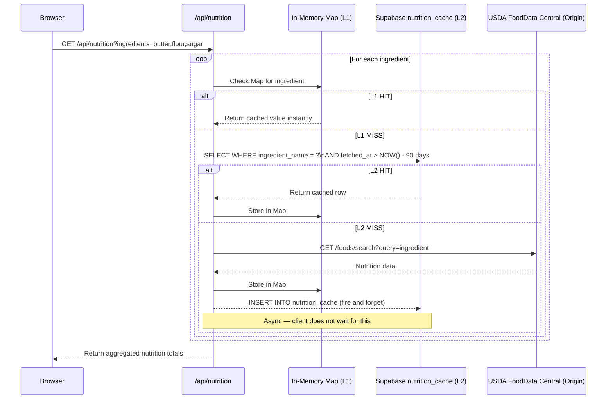

# ADR-004: Multi-Tier Nutrition Caching with USDA FoodData Central

## Status
Accepted

## Date
2026-04-03

## Context

The Living Cookbook is adding a calorie and macro counter to the recipe detail page. For each ingredient in a recipe, the system needs to retrieve nutritional data (calories, protein, fat, carbohydrates).

**Constraints:**
- A recipe may have 5–20+ ingredients — each requiring a separate nutrition lookup
- The USDA FoodData Central API is free but rate-limited
- Nutritional data for common ingredients is stable — butter is ~717kcal/100g regardless of when you ask
- The app runs on Vercel serverless functions — process memory is ephemeral and not shared across invocations
- Response time must be fast enough not to visibly degrade the recipe page load

**Options considered:**

| Option | Approach | Problem |
|---|---|---|
| A | Call USDA API directly per ingredient per request | Rate-limited, slow, expensive in quota |
| B | Cache in Supabase only | Adds DB round-trip on every request |
| C | Cache in-memory only | Lost on every cold start — ineffective on serverless |
| D | Multi-tier: in-memory → Supabase → USDA | Best of all worlds — chosen |
| E | Build our own nutrition database | Too much effort to source and maintain |

## Decision

Implement a **two-tier cache-aside pattern** in front of the USDA FoodData Central API:

- **L1 — In-memory `Map`**: Per-function-instance cache. Microsecond lookup. Ephemeral — lost on cold start.
- **L2 — Supabase `nutrition_cache` table**: Persistent cache with a 90-day TTL. Millisecond lookup. Survives restarts.
- **Origin — USDA FoodData Central**: Only called on a full L1 + L2 miss. Result written back to both caches.

The browser sends **one batched request** for all ingredients in a recipe. The API route loops internally, consulting the cache tiers per ingredient, and returns aggregated nutrition totals in a single response.

The write-back to Supabase after a USDA call is **fire-and-forget** (async) — the client receives the nutrition data without waiting for the DB write to confirm.

### Request Flow



### Supabase Schema — `nutrition_cache` Table

```sql
CREATE TABLE IF NOT EXISTS nutrition_cache (
  ingredient_name TEXT PRIMARY KEY,
  kcal_100g       NUMERIC,
  protein_100g    NUMERIC,
  fat_100g        NUMERIC,
  carbs_100g      NUMERIC,
  fetched_at      TIMESTAMPTZ DEFAULT timezone('utc', now())
);

CREATE INDEX idx_nutrition_cache_fetched ON nutrition_cache (fetched_at);
```

> **Note**: The ADR was drafted ahead of implementation. The final column names use `_100g` suffix (per 100g values) and `ingredient_name` serves as the primary key directly, removing the need for a separate `id` UUID. The `source` column was dropped as USDA is currently the only origin.

## Rationale

1. **Nutritional data is stable** — a 90-day TTL is conservative; values for common ingredients rarely change
2. **Batching prevents N+1** — one browser request for all ingredients avoids N parallel HTTP calls and their associated latency and quota cost
3. **The DB cache is the primary cache on serverless** — the in-memory Map is a secondary optimisation for warm function instances; the Supabase layer does the real work
4. **Fire-and-forget write is safe here** — nutritional data is non-critical; if a write fails, the next request will simply re-fetch from USDA and retry the write
5. **USDA FoodData Central** — chosen over Open Food Facts for broader ingredient vocabulary coverage and structured data format; requires an API key (`USDA_FDC_API_KEY`) stored as a Vercel environment secret

## Trade-offs Accepted

- **In-memory cache is unreliable on serverless** — it provides no guarantee of hit rate on Vercel; the Supabase layer must be treated as the real L1
- **Ingredient name as cache key is fuzzy** — "butter" and "unsalted butter" are different strings but nutritionally similar; no normalisation is implemented initially
- **No cache invalidation mechanism** — beyond the 90-day TTL, there is no way to force a cache refresh for a specific ingredient if USDA data changes
- **USDA data is US-centric** — coverage of European-specific products (e.g. Quark, Speck) may be limited

## Consequences

- **Positive**: Recipe page calorie display is fast for warm cache hits; USDA quota is protected; API key is stored securely as a Vercel environment secret
- **Negative**: First-ever request for an ingredient always hits USDA (expected cold-miss behaviour); ingredient name fuzzing may produce wrong matches
- **Mitigation**:
  - Add ingredient name normalisation (lowercase, trim) before cache lookup
  - Log USDA misses to identify gaps in coverage
  - Consider adding a manual override table for corrections

## Revisit Trigger

Reconsider when:
- USDA API rate limits become a bottleneck at scale (current key tier is sufficient for MVP)
- Ingredient name fuzzing causes enough incorrect results to affect user trust
- European product coverage is insufficient for the Pro Kitchen tier — at which point Open Food Facts (which has strong German product data via barcode) becomes the preferred origin
- A dedicated Nutrition Service is needed (multiple apps consuming nutrition data) — at that point, extract this into a standalone microservice with its own database

## Related Decisions

- [ADR-001](ADR-001-shared-database.md) — nutrition_cache table lives in the shared Supabase DB per the monolith-first strategy
- [ADR-003](ADR-003-ai-image-route-isolation.md) — same isolation pattern as the AI route: stateless API route, no direct DB access from the browser
