# RE-01 Lab Deliverable — Context Model

**Project**: The Living Cookbook  
**Lab**: RE-01 Requirements Engineering — Context Model  
**Date**: 2026-04-03  
**Status**: Complete

---

## The Context Model

The context model treats The Living Cookbook as a single system (black box) and maps every human actor and external system that interacts with it at runtime. Internal structure is intentionally hidden — that is addressed in D-01.

```mermaid
graph TD
    GUEST["👤 Guest\nUnauthenticated visitor"]
    HOME["🏠 Home User\nRegistered account"]
    PRO["👨‍🍳 Professional User\nPremium tier — kitchen management"]

    LC["🍳 The Living Cookbook Platform\n─────────────────────────────────\nConsumer app · Pro Kitchen tier\nRecipes · Households · Market List\nMeal Planning · AI Image Generation"]

    SUPABASE["Supabase\n─────────\nAuth (GoTrue)\nPostgreSQL + RLS\nObject Storage"]
    GEMINI["Google Gemini\nAI Image Generation"]
    VERCEL["Vercel\nHosting & CDN"]
    PAYMENT["💳 Payment Provider\ne.g. Stripe\n🔲 Future"]
    PRICING["🏪 Grocery Pricing Provider\nREWE API → Spoonacular fallback\n🔲 Future"]
    NUTRITION["🥦 USDA FoodData Central\nNutrition & Calorie Data\n✅ Live — cached in Supabase"]
    EMAIL["📧 Email / Notification Service\nPro tier alerts & staff comms\n🔲 Future"]

    GUEST -->|"browse public recipes"| LC
    LC -->|"public recipe listings & detail pages"| GUEST

    HOME -->|"create & edit recipes\nmanage household & members\nshopping list · meal plans"| LC
    LC -->|"recipe library · household data\nmarket list · meal plan calendar"| HOME

    PRO -->|"vendor management · staff scheduling\nkitchen ordering · production forecasting"| LC
    LC -->|"operational reports · order confirmations\nstaff schedules · cost analysis"| PRO

    LC <-->|"auth tokens & session management\ndata queries (recipes, households, lists)\nimage uploads · signed URL retrieval"| SUPABASE

    LC -->|"recipe context prompt\n(title, ingredients, method, aesthetic)"| GEMINI
    GEMINI -->|"generated image (base64)"| LC

    VERCEL -->|"serves app to all users"| LC
    LC -.->|"deployed via GitHub Actions"| VERCEL

    LC -->|"subscription payment request 🔲"| PAYMENT
    PAYMENT -->|"payment confirmation / failure 🔲"| LC

    LC -->|"ingredient name + region (DE) 🔲"| PRICING
    PRICING -->|"estimated price per unit 🔲"| LC

    LC -->|"ingredient name 🔲"| NUTRITION
    NUTRITION -->|"calories · macros · allergens"| LC

    LC -->|"transactional alerts · staff notifications 🔲"| EMAIL
```

---

## Actor Definitions

| Actor | Type | Description |
|---|---|---|
| **Guest** | Human — unauthenticated | Browses the public recipe feed without an account. Read-only access to `is_public = true` recipes. |
| **Home User** | Human — authenticated | Registered user managing a personal kitchen. Creates recipes, forms households, manages a shared market list, and plans meals. |
| **Professional User** | Human — authenticated, premium tier | Operates a commercial kitchen. Accesses all Home User features plus vendor management, staff scheduling, production ordering, and cost forecasting. Uses the same platform — a dedicated Pro interface is planned but not yet separate. |

---

## External System Definitions

| System | Status | What Living Cookbook sends | What it receives |
|---|---|---|---|
| **Supabase Auth** | ✅ Live | Registration data, login credentials, password reset requests | JWT tokens, session cookies, auth confirmation emails |
| **Supabase PostgreSQL** | ✅ Live | SQL queries for recipes, households, members, shopping lists, profiles | Query results, row-level filtered data |
| **Supabase Storage** | ✅ Live | Recipe image file uploads | Signed URLs for secure image retrieval |
| **Google Gemini** | ✅ Live | Recipe context prompt (title, ingredients, method, aesthetic style) | Generated image in base64 format |
| **Vercel** | ✅ Live | Next.js app bundle (deployed via GitHub) | Hosts and serves the app globally via CDN |
| **Payment Provider** | 🔲 Future | Subscription payment request (amount, user, plan) | Payment confirmation or failure |
| **Grocery Pricing Provider** | 🔲 Future | Ingredient name, region (Düsseldorf/DE) | Estimated price per unit — REWE API primary, Spoonacular fallback |
| **USDA FoodData Central** | ✅ Live (caching active) | Ingredient name (batched per recipe) | Calories, protein, fat, carbs — cached in `nutrition_cache` table for 90 days |
| **Email / Notification Service** | 🔲 Future | Notification payloads (order alerts, staff schedule changes) | Delivery confirmation |

---

## What is Outside the System Boundary

These were considered and explicitly excluded from the context model:

| Item | Why excluded |
|---|---|
| **WhatsApp** | Shopping list share is a deep link (`wa.me/?text=...`) — the user's device handles it, the server never contacts WhatsApp |
| **Google Calendar** | Meal plan event is a URL redirect to `calendar.google.com` — no API call made by the server |
| **GitHub** | Version control and CI trigger — part of the development pipeline, not a runtime dependency |
| **Developer's local machine** | Development environment — not part of the deployed system |

---

## Key Architectural Decisions Made During This Lab

### Professional User Portal
**Decision**: Professional Users access the same Living Cookbook platform — not a separate application.  
**Rationale**: Single team, single codebase, early stage. The Pro tier is a feature set, not a separate product yet.  
**Revisit trigger**: When the Pro Kitchen product has its own team, commercial model, or independent scaling needs — at that point it becomes a separate system (Option B in the analysis).

### Grocery Pricing Strategy
**Decision**: REWE unofficial API as primary source, Spoonacular as fallback.  
**Risk**: REWE's unofficial API is undocumented and can break without notice.  
**Mitigation**: Fallback to Spoonacular; graceful degradation to mock/manual pricing if both fail.  
*(Formalised as [ADR-004](docs/architecture/decisions/ADR-004-nutrition-caching-usda.md).)*

### Nutrition Data Source
**Decision**: USDA FoodData Central — structured data format, broad ingredient vocabulary, API key required (`USDA_FDC_API_KEY`). Results cached in Supabase `nutrition_cache` table with a 90-day TTL.  
*(Formalised as [ADR-004](docs/architecture/decisions/ADR-004-nutrition-caching-usda.md). Open Food Facts remains a future fallback for European product coverage.)*

---

## What Comes Next — Lab D-01

Now that we have defined the system boundary, Lab D-01 looks **inside the box**:
- What are the core business domains?
- What is the shared vocabulary (ubiquitous language)?
- Where are the bounded contexts — the natural internal service boundaries?
